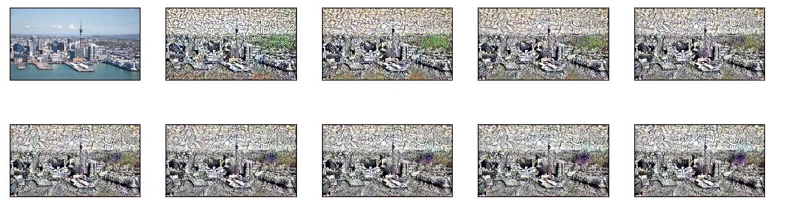

# Neural-Style-Transfer

My first tensorflow project, this is a pretty cool tutorial where you apply the style of an image onto the content image, in my case my style image was from a manga(Japanese comic book) called Naruto I then wanted to apply this art style to a photo(the content image) of Auckland, New Zealand where I currently live. I'm still new to this so please cut me some slack if my description is incorrect. With this project, we are using the trained image classification network called VGG19 and modifying the intermediate layers to suit our use case. My next goal is to create my implementation of these concepts.

You can find the tutorial here, would definately reccomend giving it a go if you're new to ML or ANNs aswell:
https://colab.research.google.com/github/tensorflow/models/blob/master/research/nst_blogpost/4_Neural_Style_Transfer_with_Eager_Execution.ipynb#scrollTo=aDyGj8DmXCJI

**Thought this was pretty cool so I shared it**
  
 
  
  
